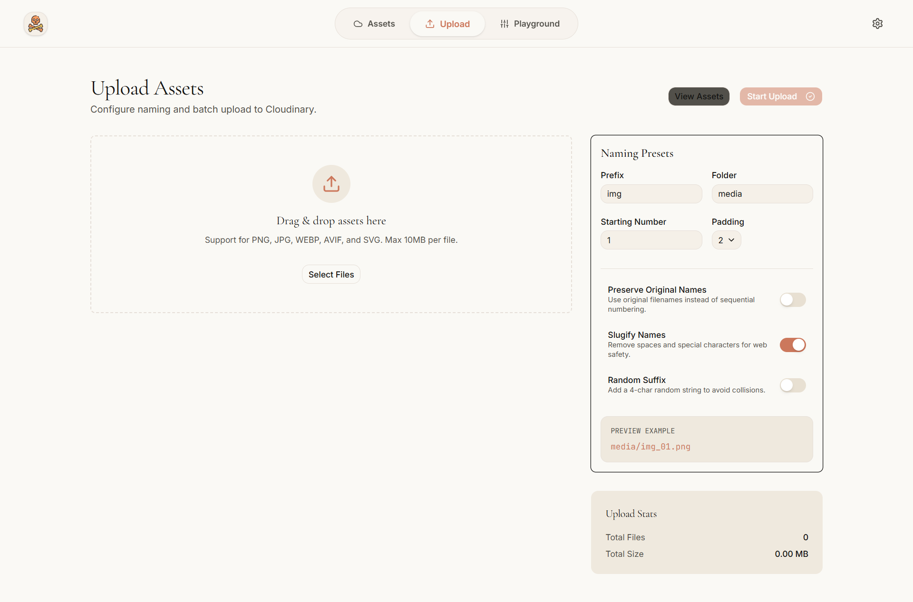
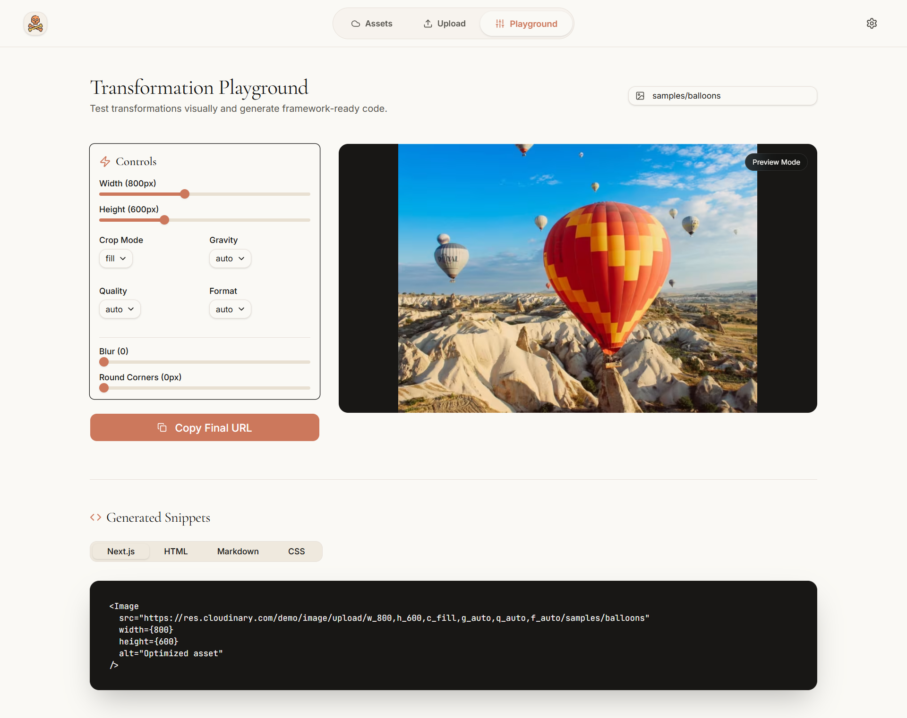
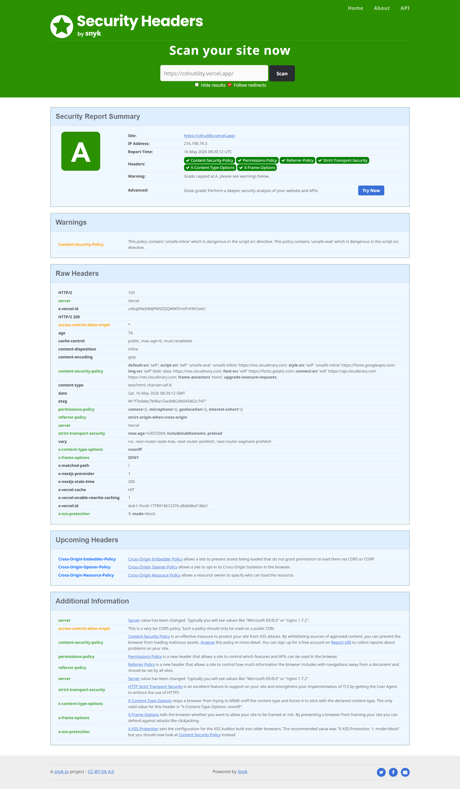

# Cloudinary Asset Utility

A production-grade internal asset management utility built with Next.js, Cloudinary, and the "Claude" design system.


## Features

### Multi-Image Upload
Drag & drop batch uploads with sequential naming. Optimized with concurrency-limited chunking and batch signature fetching for high performance.



### Asset Library
Clean grid view with search, filters, and lightbox preview. Instant access to all your Cloudinary assets with single-click URL copying.


### Transformation Playground
Visual editor for Cloudinary transforms with real-time snippet generation (HTML, Next.js, MD, CSS). Preview variations instantly.



### Smart Naming Engine
Prefix, folder, padding, and collision prevention presets. Robust 4-character random suffix logic for unique naming.

### Secure Architecture
Server-side signed uploads; Cloudinary secrets never exposed to the client. Full security hardening with CSP and production headers.



## Tech Stack

- **Framework**: Next.js 15+ (App Router)
- **Language**: TypeScript
- **Styling**: Tailwind CSS 4 + shadcn/ui
- **State**: Zustand
- **Validation**: Zod + React Hook Form
- **Storage**: Cloudinary

## Setup Guide

### 1. Cloudinary Account
1. Create a [Cloudinary](https://cloudinary.com/) account.
2. Get your **Cloud Name**, **API Key**, and **API Secret** from the Dashboard.

### 2. Environment Variables
Create a `.env.local` file in the root directory:

```env
CLOUDINARY_CLOUD_NAME=your_cloud_name
CLOUDINARY_API_KEY=your_api_key
CLOUDINARY_API_SECRET=your_api_secret

# Security Settings
MAX_FILE_SIZE_MB=10
MAX_BATCH_UPLOAD=50
```

### 3. Installation
```bash
npm install
```

### 4. Run Locally
```bash
npm run dev
```

## Architecture

- `/src/app`: App Router pages and layouts.
- `/src/actions`: Server Actions for secure Cloudinary operations.
- `/src/components`: Modular UI components (upload, preview, shared).
- `/src/lib`: Cloudinary client, naming engine, and validators.
- `/src/store`: Zustand state management for upload queue.

## Security Note

This app uses **Signed Uploads**. The signature is generated on the server via `src/actions/cloudinary.ts` and passed to the client for a direct, secure upload to Cloudinary. Your `API_SECRET` remains safely on the server.
